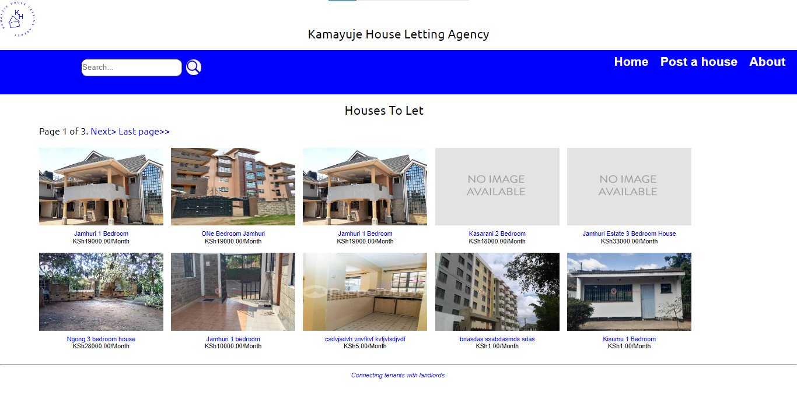

# Kamayuje House Letting Agency

_**By Rosemary Ojwang**_

*An application that connects tenants with landlords.*

## Technologies Used
* Python
* HTML
* CSS

## Description
*The application allows landlords to sign up, login, and post houses for potential tenants to view. The landlords are also able to view all the houses they've posted, modify the house details, and even delete the houses from the site if need be. They can also logout once they are done.*

*Potential tenants can view the details of the houses, and contact the landlords for physical house viewing, and maybe proceed to rent the houses.*  

## Set Up/Installation Requirements
1. `git clone https://github.com/RosemaryOjwang/House-Letting-Agency` to your desktop.

2. Navigate to the directory 'House-Letting-Agency' using the command `cd House-Letting-Agency`

3. Create a virtual environment using the command `python -m venv env`

4. Activate the virtual environment using;
    * for windows use `env\Scripts\activate`
    * for Linux and MacOS use `source env/bin/activate`

5. Run requirements file to install libraries using the following;
`pip install -r requirements.txt`

6. Make migrations using the following commands;
    1. `python manage.py makemigrations`
    2. `python manage.py migrate`

7. Create a superuser using the following command:
`python manage.py createsuperuser`

8. Run the server using the command `python manage.py runserver`

9. Open http://localhost:8000/ on your browser.

## Known Bugs
*The multiple images of the different sections of the houses blink on hover.*

## License
[MIT](https://opensource.org/license/mit/)

_Copyright (c) 2023._ _**Rosemary Ojwang**_

